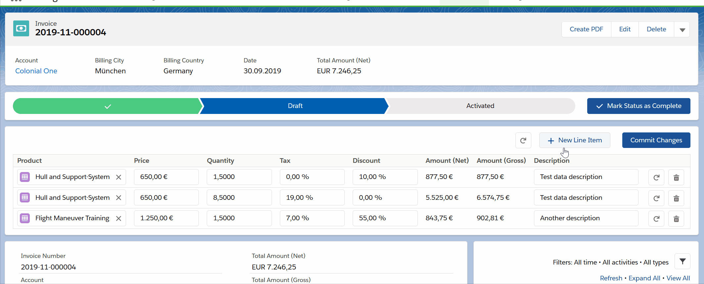
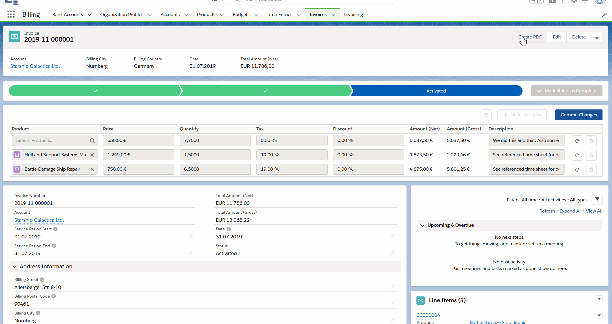

# Introduction
This app implements basic billing functionality for freelancers and small consultancies.
The app is created and developed based on my personal needs as an independent salesforce consulting and implementation partner.
I currently do not have decided upon a license, so please do not fork / clone!

# Overview
In a galaxy far, far away, this app will provide full Billing / Account Management capabilities. For now, you can:
* Create Budgets for your Accounts to keep track of hours logged and hours invoiced (against said budget)
* Log time entries to track your work (and enrich wich different type of services (products) and the resource)
* Bill these time entries and generate invoices
* Generate PDFs (based on a fixed template) for your invoices and send invoices per e-mail to billing contacts.

I use JIRA to organize releases and epics, however the release logs in GitHub are accurate.

# Functionality

## Mass Edit Line Items
* Conventiently mass-edit line items in tableview
* Highlight edited cells (fields) and new rows
* Reset changes (for complete table or single row)
* Add new rows and delete complete rows with single button-clicks
* Commit all changes with a single button-click



## Preview the generated PDF
* Multi-Language support (easily add additional languages with Translation Workbench)
* Toggle rendering of the Invoice's timesheet
* Select your company profile, that is used to fill header and footer
* Review all changes in real-time



## Add Watermark on PDFs for Draft Invoices

# Contribute
Please contact me if you want to fork the repo or contribute. Lincense is tbd.

## Branching Model
Branching model is based on GitFlow, but slightly adjusted to better work with SFDX (Package deploys & CI). The main stable branch is `master` and I use multiple feature and version branches (`feature/PB-xx-story-name` and `version/major.minor.patch`) where development is done. To reduce overhead, work can be done in both feature and version branches (as long as the version is developed by a single person). Feature branches always merge to version branches. Version branches merge to master. CI triggers on version branches will create new package versions and install them on Staging / UAT Sandboxes and perform a full regression run of all apex & jest tests.

## Development Workflow
Setup Scratch org using the scripts. This will speed up test data import, permission sets, etc.

Windows:
```shell
.\dev-tools\win\default_init.ps1 -a "ScratchAlias"
```

MacOs:
```shell
bash dev-tools/macOS/default_init.sh
```